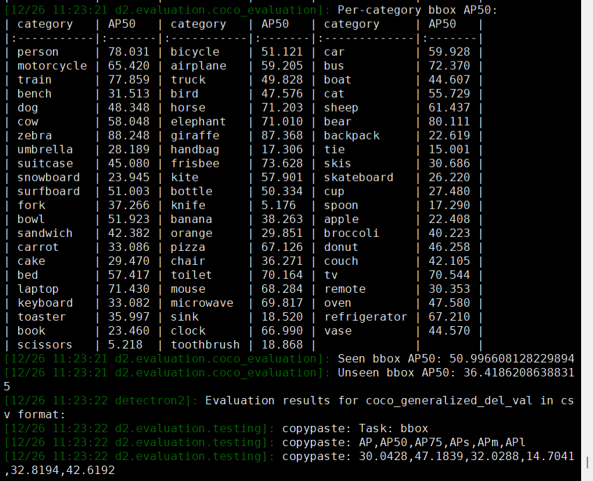

<h2 align="center">
✨SAM based Region-Word Clustering and Inference Score Adjusting for Open-Vocabulary Object Detection
</h2>

This repository is the official implementation of [**SAM based Region-Word Clustering and Inference Score Adjusting for Open-Vocabulary Object Detection**](https://dl.acm.org/doi/10.1145/3746027.3754501) accepted by [**ACM MM 2025**](https://acmmm2025.org/).      
> Qiuyu Liang, Yongqiang Zhang*  

## 📍Installation
### Requirements
- Linux with Cuda == 11.1.
- Python == 3.8.20.
- PyTorch == 1.9.0.
  Install them together at [pytorch.org](https://pytorch.org) to make sure of this. Note, please check
  PyTorch version matches that is required by Detectron2.
- Detectron2: follow [Detectron2 installation instructions](https://detectron2.readthedocs.io/tutorials/install.html).

### Example conda environment setup
```bash
conda create --name cadet python=3.8.20 -y
conda activate cadet
pip install torch==1.9.0+cu111 torchvision==0.10.0+cu111 torchaudio==0.9.0 -f https://download.pytorch.org/whl/torch_stable.html -i https://pypi.tuna.tsinghua.edu.cn/simple

# under your working directory

git clone https://github.com/llqy123/CADet.git
cd CADet
cd detectron2
pip install -e .
cd ..
pip install -r requirements.txt
```

## 🚀Benchmark evaluation and training

Please first [prepare datasets](prepare_datasets.md).

Similar to baseline **VLDet**, our CADet models are finetuned on the corresponding [Box-Supervised models](https://drive.google.com/drive/folders/1ngb1mBOUvFpkcUM7D3bgIkMdUj2W5FUa?usp=sharing) (indicated by MODEL.WEIGHTS in the config files). Please train or download the Box-Supervised model and place them under CADet_ROOT/models/ before training the CADet models.

To train a model with OV-COCO dataset, run

```
python train_net.py --num-gpus 8 --config-file configs/CADet_OVCOCO_CLIP_R50_1x_caption.yaml
``` 

To evaluate a model with a trained/ pretrained model, run 

```

python train_net.py --num-gpus 8 --config-file configs/CADet_OVCOCO_CLIP_R50_1x_caption.yaml --eval-only MODEL.WEIGHTS /path/to/weight.pth
``` 

Download the trained network weights.

| OV-COCO  | Novel AP50 | Base AP50 | Overall AP50 | Weight |
|----------|-----------|-----------------|-----------------|-----------------|
| [config_RN50](configs/CADet_OVCOCO_CLIP_R50_1x_caption.yaml) | 36.4      | 50.6            |46.9             | paper| 
| [config_RN50](configs/CADet_OVCOCO_CLIP_R50_1x_caption.yaml) | 36.4      | 51.0            |47.2             | [weight](https://drive.google.com/file/d/1wsLp4MO-Cpy0Y6wwqWiPwsRoP6hu-8jH/view?usp=sharing)| 
<p align="left">

<p>

## 🙏Citation

If you find this project useful for your research, please use the following BibTeX entry.

```
@inproceedings{liang2025sam,
  title={SAM based Region-Word Clustering and Inference Score Adjusting for Open-Vocabulary Object Detection},
  author={Liang, Qiuyu and Zhang, Yongqiang},
  booktitle={Proceedings of the 33rd ACM International Conference on Multimedia},
  pages={2596--2605},
  year={2025}
}
```

## 🤝Acknowledgement
This repository was built on top of [Detectron2](https://github.com/facebookresearch/detectron2), [Detic](https://github.com/facebookresearch/Detic.git), [RegionCLIP](https://github.com/microsoft/RegionCLIP.git), [OVR-CNN](https://github.com/alirezazareian/ovr-cnn), [VLDet](https://github.com/clin1223/VLDet) and [Segment Anything Model](https://github.com/facebookresearch/segment-anything/tree/main). We thank for their hard work.
